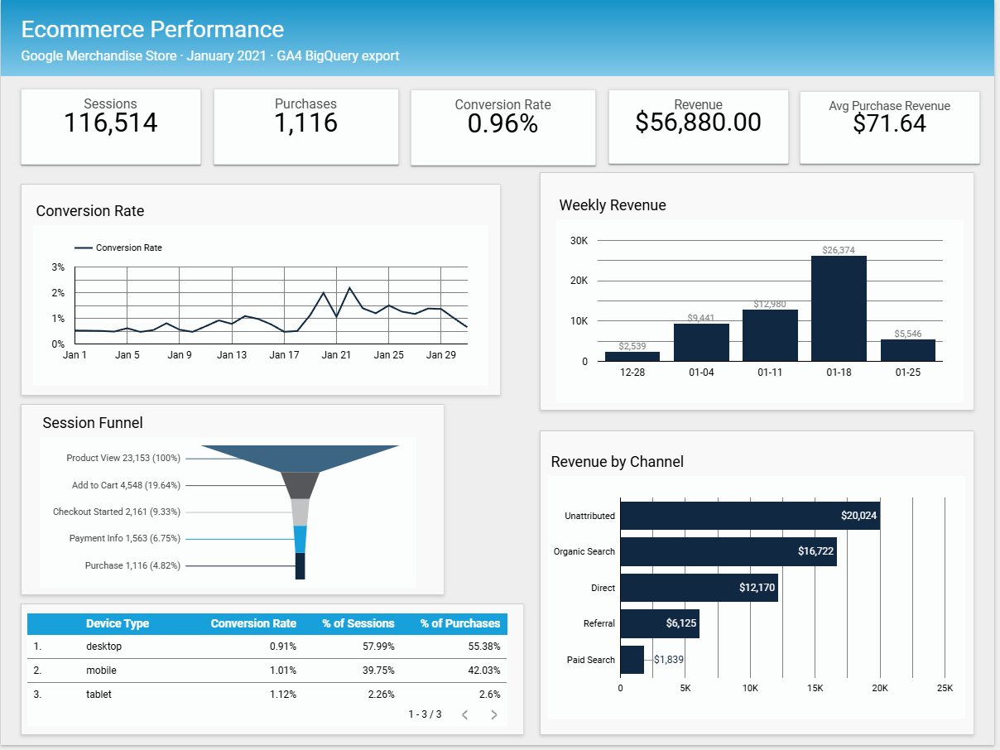

# ga4-funnel-bigquery-looker
GA4 e-commerce performance dashboard built with BigQuery, SQL, Python, and Looker Studio.

## Question

Where does the ecommerce funnel lose sessions?

## Data
[Google Analytics 4 sample ecommerce export](https://console.cloud.google.com/marketplace/product/bigquery-public-data/ga4-obfuscated-sample-ecommerce)
-obfuscated event data from the Google Merchandise Store

## Method
-**Grain:** Data is extracted at the event level and reshaped into two outputs (distinct sessions for the funnel, and the purchase data remains at the event level).

-**Identity:** User_pseudo_id is used, as user_id only populates post-login.
Session Key : The GA4 data has no unique session identifier. Ga_session_id  is a time-stamp of when the session began. A unique key is created using pseudo_user_id and Ga_session_id.

-**Funnel steps:** Counted as unique sessions per step rather than raw events. A session with 3 items added to their cart counts in the funnel once. One row per day, device type, and funnel step, with a count of the distinct sessions in that row.

-**Purchases:** One row per transaction. De-duped on session key and transaction ID to remove double-fired events.
-**Revenue:** uses ecommerce.purchase_revenue

SQL in BigQuery extracts the data and filters for the relevant events/time. Python reshapes it, explores data quality, and aggregates. Looker Studio is used to visualize the findings. 

## Findings
 **1. A quarter of purchase events carry no order data.**
 275 of 1,170 purchase events (23.5%) fire with no transaction ID and no revenue value. These count as conversions, but either produce no order, or are not tracked. There are about 21,000 self-referral sessions in the same period, and it is possible that some of these orders are being processed on an external payment service like PayPal. This is a hypothesis that would require further investigation.

**3. Sessions drop off before checkout, not during it.** 
Most of the drop-off happens in the product decision and exploration stage of shopping.
Only 19.1% of sessions that view products add any to the cart. Once a session is at the checkout stage, 51.6% complete a purchase. Conversion is consistent between mobile/desktop, so this is not due to a device compatibility issue. 

## Setup 
Requires a Google Cloud project with the BigQuery API enabled. The dataset is public. 
The python script connects to your BigQuery account and runs the query.

Download Google Cloud SDK
https://cloud.google.com/sdk

Authenticate
In gcloud auth application-default login
This opens a browser sign-in and then prompts you to select a project. 
Choose your own bigquery project, then set `PROJECT_ID` in the python script to match. 

Install Python packages
pip install google-cloud-bigquery pandas db-dtypes
pip install google-cloud-bigquery-storage 
